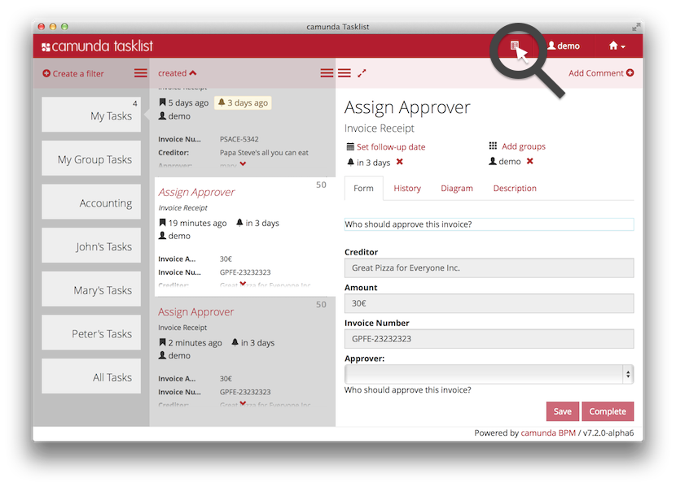
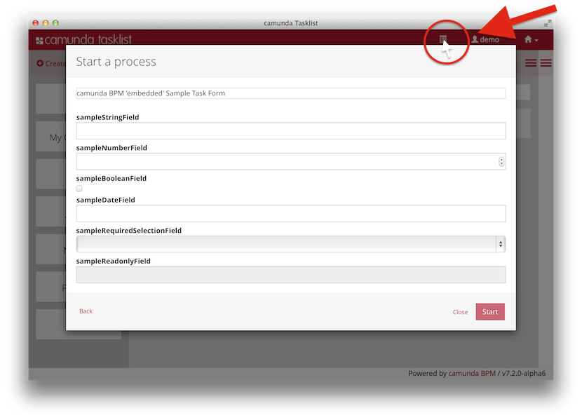

# camunda Grails plugin 

This plugin integrates camunda BPM with the **Grails 2** web application framework. 
It's therefore **outdated** in the sense that Grails 3 is out there since a long time.
There is currently no work going on in the direction of porting this plugin to Grails 3.

**[camunda BPM](http://camunda.org)** is a flexible framework for workflow and process automation. 
It's core is a native **[BPMN 2.0](http://www.omg.org/spec/BPMN/2.0/)** process engine that runs 
inside the Java Virtual Machine. It is a perfect match for the Spring Framework - and therefore 
for **[Grails](http://grails.org)**, too.


> Currently the plugin comes bundled with a dependency to the release **7.3.0** of camunda BPM. 
> However you can use it with all 
> [other versions](http://plexiti.github.io/camunda-grails-plugin/guide/configuration.html#alternative-engine-version), too.

<a name="get-started"/>
## Deploy your first camunda Grails App in 3 minutes

```bash
1> grails create-app camunda-on-grails # and add a plugin dependency: compile ':camunda:0.4.0'
2> grails create-process my.own.camunda.GrailsProcess
3> grails war # and deploy it in the camunda BPM tomcat container
```

Then open [http://localhost:8080/camunda-on-grails-0.1/camunda](http://localhost:8080/camunda-on-grails-0.1/camunda), 
browse to camunda tasklist and work with your own camunda GrailsProcess. But if you are new to camunda BPM and/or 
Grails, you might want to read the long story:

<a name="install"/>
### 1. Create a fresh Grails App and install camunda Grails Plugin

[Download and install grails](https://grails.org/download), then on your command line, type
```bash
grails create-app camunda-on-grails
```
In your `camunda-on-grails/grails-app/conf/BuildConfig.groovy`, add to the plugins section
```groovy
plugins {
    compile ":camunda:0.5.0"
}
```
and back in your `camunda-on-grails` project folder execute
```bash
grails refresh-dependencies
```

<a name="install"/>
### 2. Create a fresh camunda BPM process definition

Still in your `camunda-on-grails` project folder, type
```bash
grails create-process my.own.camunda.GrailsProcess # or any other package and name of your choice
```
You should see the following two files generated by Grails:
```bash
| Created file grails-app/processes/my/own/camunda/GrailsProcess.bpmn
| Created file test/integration/org/my/own/camunda/GrailsProcess.groovy
```
It's a minimal process, to get you started and build upon (plus a small spec to check that it works). 
If you'd look at it with [camunda modeler](http://camunda.org/bpmn/tool/), it would look like


You will now already be able to **use camunda BPM as internal process engine** for your grails application. 
Maybe you want to `grails test-app` and have a look at the 
[spock specification](test/integration/grails/plugin/camunda/test/TestProcessSpec.groovy) 
executed by that command. However, if you want to see **camunda BPM tasklist in action**, you will want to move on and ...

<a name="install"/>
### 3. Download camunda BPM and deploy your Grails WAR file

[Download camunda BPM **Tomcat**](http://camunda.org/download/) and expand it to a folder, let's call it 
$CAMUNDA_HOME. Start camunda BPM Tomcat by executing:

```bash
./start-camunda.sh
```

Back in your camunda-on-grails project folder, excecute
```bash
grails war
cp target/camunda-on-grails-0.1.war $CAMUNDA_HOME/server/apache-tomcat-7.0.50/webapps
```
Now open [http://localhost:8080/camunda-on-grails-0.1/camunda](http://localhost:8080/camunda-on-grails-0.1/camunda).
But don't browse to the invoice sample, instead directly select the tasklist application, login with username 
`demo` password `demo` and start your *GrailsProcess* by clicking on that button in the top right corner:



The start form you will now see is delivered by your grails application:
 

 
Make a selection in the required dropdown field and actually **start** your process. Then move to the tasks 
assigned to you and find the Sample UserTask. Select the "Diagram" Pane and see the simple process you just 
created by issueing `grails create-process`:


The process execution is waiting at the user task, which wants to be completed via our grails form presented 
in the form pane.

Pretty cool, right? What's even cooler is that there is **not much 'magic'** happening behind the scenes. You just 
created a bpmn process definition (plus a corresponding 'spock' test specification) and use now a sample gsp 
form provided by the plugin. When reading the extensive camunda Grails Plugin 
[documentation](http://plexiti.github.io/camunda-grails-plugin), you will learn that the plugin sets very few 
sensible defaults for you to get started quickly, but everything remains under your full control.

**Congratulations!** You are now "in driver's seat" of a **rapid process application development framework**,
for both 'data' as well as 'process': your 'Sample Service Task' calls a Grails Service and in your embedded Task 
Form you can leverage server side gsp as well as client side js rendering and present all the context domain 
data necessary for the user to complete the task at hand. 

To obtain your driver's license for that racing car, you might now want to...

<a name="get-in-touch"/>
## Get in touch with camunda BPM and Grails!

If you don't yet know either camunda or grails - it's very much worth a look! Go straight to the extensive 
**[camunda Grails Plugin Guide](http://plexiti.github.io/camunda-grails-plugin/)**!
But in particular check out **[camunda.org](http://camunda.org/get-started/)** to get started with 
camunda BPM and **[grails.org](http://grails.org/learn)** to learn Grails in 5 easy steps. 

<a name="resources"/>
## Resources

* **[http://grails.org/plugin/camunda](http://grails.org/plugin/camunda)**
* [Documentation](http://plexiti.github.io/camunda-grails-plugin)
* [Releases](https://github.com/plexiti/camunda-grails-plugin/releases)
* [Changelog](https://github.com/plexiti/camunda-grails-plugin/milestones?direction=desc&sort=completeness&state=closed)
* [Roadmap](https://github.com/martinschimak/camunda-grails-plugin/milestones)
* [Issue Tracking](https://github.com/plexiti/camunda-grails-plugin/issues)
* [Continuous Integration](https://plexiti-foss.ci.cloudbees.com/job/camunda-grails-plugin/job/camunda-grails-plugin/)
* [Maven Release Repository](http://repo.grails.org/grails/plugins-releases/org/grails/plugins/camunda/)
* [Maven Snapshot Repository](https://repository-plexiti-foss.forge.cloudbees.com/snapshot/org/grails/plugins/camunda/)

Want to **contribute**? Need help? You are very welcome! Please contact me directly via [eMail](mailto:martin.schimak@plexiti.com).

<a name="maintainer"/>
## Maintainer

Martin Schimak - [eMail](mailto:martin.schimak@plexiti.com) - [GitHub](https://github.com/martinschimak) - [Blog](http://plexiti.com)

<a name="license"/>
## License

Apache License, Version 2.0
